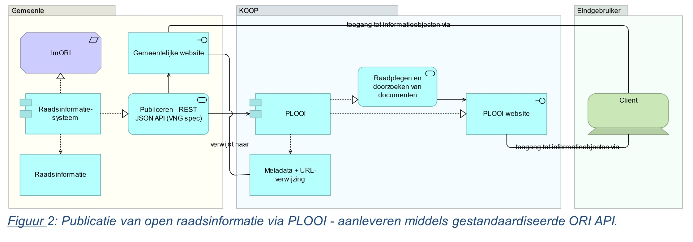
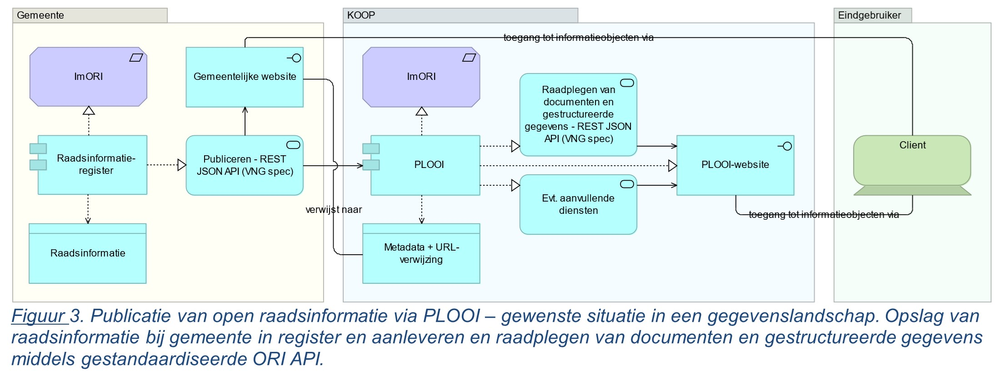

**NOTITIE**

| **Onderwerp** | **:** | Architectuur openbaarmaking open raadsinformatie via PLOOI |
| --- | --- | --- |
| **Auteur** | **:** | Ivo Hendriks |

### Een transparante overheid

#### Open (raads)informatie

De Wet open overheid (Woo) heeft een transparante overheid tot doel. Overheden zullen daarom worden verplicht een aantal categorieën overheidsinformatie openbaar te maken. Eén van deze categorieën betreft ingekomen stukken, agenda&#39;s, verslagen en besluiten van gemeenteraden (verder: raadsinformatie).

Een deel van de Nederlandse gemeenten maakt raadsinformatie al actief openbaar. Ongeveer 120 gemeenten bieden hun raadsinformatie aan voor publicatie en hergebruik via raadsinformatie-portaal [openraadsinformatie.nl](https://zoek.openraadsinformatie.nl/). Dit platform is tot stand gekomen door een samenwerking tussen de Open State Foundation en VNG Realisatie. Het is ontwikkeld door Argu en Ontola. ([GitHub-pagina open raadsinformatie](https://github.com/openstate/open-raadsinformatie)).

 Door VNG Realisatie zijn bovendien een informatiemodel voor raadsinformatie en een daarbij aansluitende Application Programming Interface (API) gedefinieerd. Deze API wordt op dit moment nog gebruikt.

In voorbereiding op de Wet open overheid wordt door het Kennis- en Exploitatiecentrum Officiële Overheidspublicaties (KOOP) het Platform Open Overheidsinformatie (PLOOI) ontwikkeld. Middels dit platform kunnen overheden hun openbaar te publiceren overheidsinformatie aanbieden. VNG en VNG Realisatie en KOOP willen het mogelijk maken dat gemeenten hun raadsinformatie via PLOOI beschikbaar stellen voor (her)gebruik.

### Openbaar publiceren van open raadsinformatie: huidige situatie

De bestaande oplossing voor publicatie van raadsinformatie op [openraadsinformatie.nl](https://zoek.openraadsinformatie.nl/) is geïllustreerd in Figuur 1.

#### Hoe het werkt

Raadsinformatie wordt met behulp van verschillende, leverancierspecifieke kopplakken opgehaald uit de raadsinformatiesystemen van aangesloten gemeenten. Deze raadsinformatie wordt in een centrale database gecached en gestandaardiseerd volgens de internationale Popolo-standaard voor open overheidsinformatie. Om het gestructureerd modelleren van (raads)vergaderingen mogelijk te maken, is deze standaard door de ontwikkelaars met een aantal concepten uitgebreid. ([GitHub-pagina APIs open raadsinformatie](https://github.com/ontola/ori-search/blob/master/docs.md)).

 De gecachte en gestandaardiseerde raadsinformatie is toegankelijk voor (her)gebruik via een REST JSON-API. Voor het doorzoeken van datasets is bovendien is een zoek API (op basis van ElasticSearch) beschikbaar.

Via openraadsinformatie.nlbeschikbare raadsinformatie is gemodelleerd volgens RDF(linked data)-conventies en kan verschillende manieren (RDF/XML, Turtle, N-Triples, JSON-LD, N3, Notation3, Zip, JSON+RDF) worden geserialiseerd.

 Resources (agendapunten, documenten, personen, etc.) worden geïdentificeerd met een persistente (dus een onveranderbare) URL.

Wijzingen in opgeslagen raadsinformatie worden in een log bijgehouden. De verschillende versies die hierdoor ontstaan zijn opvraagbaar, wat (her)gebruikers in staat stelt om aan de hand van versies &#39;door de tijd te reizen&#39;. Metadata beschrijven onder meer moment van creatie, bewerkingen en herkomst. De software die is ontwikkeld om de data te aggregeren, te verrijken en te bekijken is gepubliceerd onder een open sourcelicentie.

### Uitgangpunten: het GEMMA gegevenslandschap en open data

Het GEMMA gegevenslandschap is uitwerking in architectuur van de informatiekundige visie Common Ground. Doel hiervan het verbeteren van de gemeentelijke dienstverlening. Dit wordt bereikt door de informatievoorziening zo te hervormen dat gemeenten snel(ler) en flexibel(er) kunnen vernieuwen, eenvoudiger kunnen voldoen aan wet- en regelgeving en efficiënt om kunnen gaan met gegevens. ([Wat is Common Ground?](https://commonground.nl/cms/view/54476259/wat-is-common-ground))

#### Eenmalig vastleggen, meervoudig gebruiken

Eén van de kernprincipes van het GEMMA gegevenslandschap is dat gegevens eenmalig worden ingewonnen en vastgelegd in bronregisters. Deze bronregisters faciliteren middels gegevensdiensten meervoudig gebruik, bijvoorbeeld door informatiesystemen die gegevens verwerken bij uitvoeren van processen. Dit principe heeft gevolgen voor het openbaar toegankelijk publiceren van gegevens(sets); hiervoor wordt bij voorkeur verwezen naar de (via internet toegankelijk gemaakte) opslaglocatie van een informatieobject in een bronregister.

Bovenstaand principe stelt eisen aan beschikbaarheid van bronregisters en gegevensdiensten. Gegevens moeten in een gegevenslandschap dus zodanig beschikbaar zijn dat interactie tijd-, plaats- en apparaatonafhankelijk kan plaatsvinden (bijvoorbeeld door brongegevens 24x7 beschikbaar te stellen en interfaces te bieden die voor verschillende typen interactie-applicaties bruikbaar zijn). ([Principes informatiearchitectuur GEMMA gegevenslandschap, p. 12.](https://redactie.gemmaonline.nl/images/redactiegemma/6/67/20190328_-_Gemeentelijk_Gegevenslandschap_-_Informatiearchitectuurprincipes.pdf))

 Welke maatregelen in specifieke gevallen nodig zijn om beschikbaarheid van gegevens in registers te garanderen, is uiteraard afhankelijk van beschikbaarheidseisen, risico&#39;s en kosten om die te mitigeren.

#### Standaardiseren van gegevens

Gemeenten werken samen met steeds meer partijen. Afspraken en standaarden zijn nodig om effectief, efficiënt en veilig samen te werken en informatie uit te wisselen.([Principes informatiearchitectuur GEMMA gegevenslandschap, p. 14.](https://redactie.gemmaonline.nl/images/redactiegemma/6/67/20190328_-_Gemeentelijk_Gegevenslandschap_-_Informatiearchitectuurprincipes.pdf))

 Standaarden dragen er bovendien aan bij dat gemeenten zelf, en niet hun leveranciers &#39;in control&#39; zijn over toegang tot en gebruik van gemeentelijke gegevens. Net zoals bij de landelijke basisregistraties is gebeurd, standaardiseren gemeenten in een gegevenslandschap daarom de (gemeentelijke) brongegevens die zij beheren. ([Principes informatiearchitectuur GEMMA gegevenslandschap, p. 11.](https://redactie.gemmaonline.nl/images/redactiegemma/6/67/20190328_-_Gemeentelijk_Gegevenslandschap_-_Informatiearchitectuurprincipes.pdf))

Het vereenvoudigen van openbaarmaking en het vergroten van de mogelijkheden voor hergebruik zijn andere belangrijke redenen voor het standaardiseren van gegevens. Standaardisatie op inhoud, context en techniek maakt het immers mogelijk om bijvoorbeeld de raadsbesluiten van meerdere gemeenten op te halen om die met elkaar te vergelijken.

Voor uitwisseling van gegevens in een gegevenslandschap wordt bij voorkeur gebruik gemaakt van RESTful APIs die brongegevens in JSON-formaat leveren. Deze APIs conformeren zich aan landelijke standaarden zoals de API strategie voor de Nederlandse overheid, en worden beschreven volgens de OAS 3.x-specificatiestandaard. ([Beschrijving informatiearchitectuur GEMMA Gegevenslandschap, p. 27.](https://www.gemmaonline.nl/images/gemmaonline/5/56/GEMMA_Gegevenslandschap_-_Beschrijving_informatiearchitectuur.pdf))

 Bij het beschikbaar maken van open data wordt (naast eventuele andere kanalen) bij voorkeur gebruik gemaakt van de daarvoor beschikbare overheidsbrede publicatiekanalen (bijvoorbeeld data.overheid.nl of het Nationaal Georegister). ([Principes informatiearchitectuur GEMMA gegevenslandschap, p. 7 en 8](https://redactie.gemmaonline.nl/images/redactiegemma/6/67/20190328_-_Gemeentelijk_Gegevenslandschap_-_Informatiearchitectuurprincipes.pdf))

### Toegang tot raadsinformatie via PLOOI: situatie in een gegevenslandschap

Hoewel de bestaande oplossing voor publicatie van raadsinformatie makkelijk is voor leveranciers – zij worden ontzorgd doordat standaardisatie van gegevens aan de platformkant plaatsvindt – en hergebruikers veel mogelijkheden biedt, sluit deze op een aantal vlakken niet aan bij de architectuur van het GEMMA Gegevenslandschap. Figuur 3 toont hoe raadsinformatiegegevens zonder publicatiebeperkingen binnen een gegevenslandschap openbaar toegankelijk gemaakt kunnen worden via PLOOI.

#### Hoe het werkt

In lijn met het gegevenslandschap-standaardisatieprincipe is het raadsvergaderingendomein door VNG Realisatie gegeneraliseerd en gemodelleerd in het [informatiemodel Open Raadsinformatie.](./informatiemodel.md)

 Een op dit model gebaseerde REST JSON-interface geeft toegang tot in het raadsinformatieregister opgeslagen gegevens. Deze interface is eveneens gespecificeerd door VNG Realisatie en sluit aan bij de API-strategie voor de Nederlandse overheid. ([API-strategie voor de Nederlandse overheid](https://docs.geostandaarden.nl/api/API-Strategie/)), Rapport [Informatiemodel Open Raadsinformatie](https://www.vngrealisatie.nl/sites/default/files/2018-08/20180701%20informatiemodel%20ORI%20vs1_01%20.pdf)).

 De hierboven beschreven interface kan gebruikt worden om raadsinformatie toegankelijk te maken via de eigen gemeentelijke website, maar kan ook worden gebruikt om metadata en URL-verwijzingen over te brengen naar PLOOI. Dit kan zowel via een pull- (eventueel voorafgegaan door een notificatie over de beschikbaarheid van nieuwe gegevens) als een pushmechanisme. Aansluitend bij het Gegevenslandschap-principe &#39;eenmalig vastleggen, meervoudig gebruiken&#39; blijft de inhoudelijke raadsinformatie in beide gevallen bij de gemeente opgeslagen. Vanuit PLOOI wordt middels de aangeleverde URL verwezen naar publicatieplaats op de gemeentelijke website. Het op deze manier realiseren van de functionaliteit voor het aanleveren van raadsinformatiedocumenten met bijbehorende metadata (Figuur 2Fout! Verwijzingsbron niet gevonden.) is de eerste en belangrijkste stap in het toegankelijk maken van raadsinformatie via PLOOI.

 

Om het mogelijk te maken dat (her)gebruikers raadsinformatie van meerdere overheidsinformaties kunnen opvragen zonder daarvoor de door die organisaties beschikbaar gestelde APIs individueel te bevragen, is het gewenst dat raadsinformatie via PLOOI beschikbaar gesteld wordt via dezelfde gestandaardiseerde REST JSON-interface als voor dat doel door gemeenten wordt gebruikt. Deze functionaliteit is onderdeel van de uiteindelijk in een gegevenslandschap gewenste situatie zoals geïllustreerd in Figuur 3. Deze functionaliteit zal waarschijnlijk niet in eerste instantie gerealiseerd worden.

